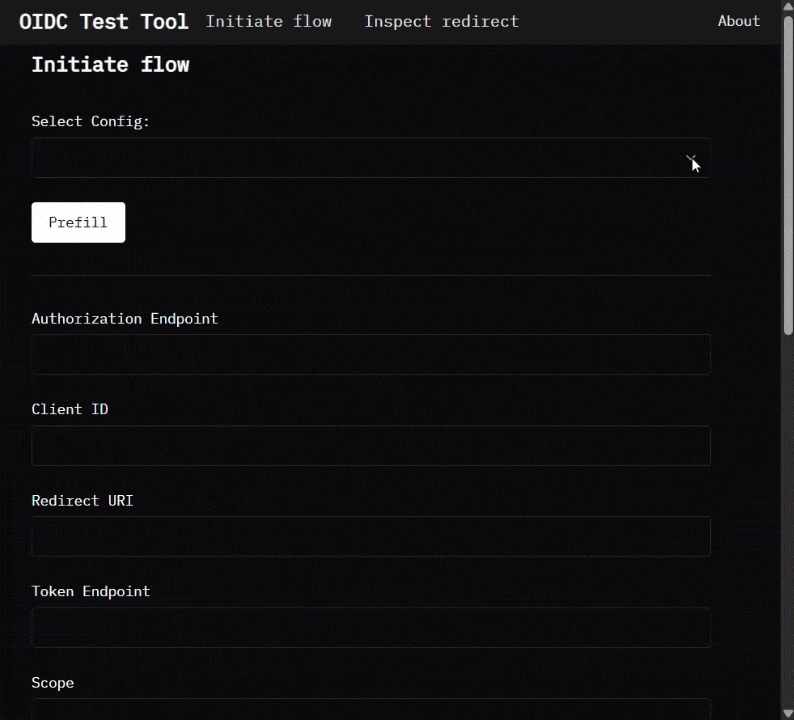

# OIDC Test Tool

A React-based debugging tool for OpenID Connect (OIDC) authentication flows. This application helps developers test and inspect OIDC authentication requests and responses.

## Interface

<div align="center">
  
  <p>OIDC Test Tool in action</p>
</div>

## Features

- **Request Construction**
  - Build OIDC authentication requests with customizable parameters
  - Create pre-configured examples for common flows
  - Add custom parameters to requests
  - Real-time URL preview

- **Response Inspection**
  - Decode and display JWT tokens
  - Verify state parameter matches
  - Support for authorization code exchange and PKCE

- **Security**
  - All data is processed client-side and on the OIDC provider the user chooses
  - Some data (except secrets) is stored in the browser's local storage
  - Users are advised not to use production secrets or sensitive tenant data
  - The project is intended for testing and debugging only

## Getting Started

You can try the application here: <https://calm-plant-0cc61d103.6.azurestaticapps.net/>

Demo user credentials: user@example.com / abcdef

Pick one pre-configured example from the dropdown and click **Redirect** to see the flow in action.

### Support

- Only supported environment is in VS Code and Dev Containers. Other environments may work but are not tested.
- For issues, please use GitHub Issues: <https://github.com/JakubVrch/oidc-test-tool/issues>

### Installation and Development Setup

There is no separate installation workflow for this tool. Installation and development setup are the same process.

1. Clone the repository:

```bash
git clone https://github.com/JakubVrch/oidc-test-tool.git
cd oidc-test-tool
```

2. Open the folder in VS Code.
3. Install workspace-recommended extensions from `.vscode/extensions.json` (Command Palette: **Extensions: Show Recommended Extensions**).
4. Run **Dev Containers: Rebuild and Reopen in Container**.
5. After the container starts, install dependencies and run the app:

```bash
yarn install
yarn dev
```

The application will be available at `http://localhost:5173`

The dev container post-create step configures Corepack and installs the Yarn version pinned by `packageManager` in `package.json`.

### Useful Commands

```bash
yarn dev
yarn test
yarn lint
yarn prettier:check
yarn knip
yarn tsc -b
yarn build
```

### Pull Request Quality Gates

Pull requests to `main` run parallel CI checks for code quality and release safety:

- `typecheck`: `tsc -b`
- `lint`: `eslint .`
- `prettier`: `prettier --check .`
- `knip`: `knip`
- `test`: `jest --maxWorkers=4 --coverage`
- `build`: `vite build`

The `test` job publishes a coverage summary and uploads the `coverage/` artifact. Failed checks block PR merge once configured as required status checks in branch protection.

Local preflight (same order as CI intent):

```bash
yarn tsc -b
yarn eslint .
yarn prettier:check
yarn knip
yarn test --maxWorkers=4 --coverage
yarn vite build
```

### Configuration

The application is configured through `src/config/exampleConfig.ts`. This file contains pre-configured OIDC request examples and default settings.

## Roadmap

1. TODO: Token introspection
2. TODO: Logout
3. TODO: UserInfo
4. TODO: OpenID Connect discovery (.well-known/openid-configuration)
5. TODO: Form POST response mode support (requires backend)
6. TODO: Environment variable configuration and Docker image
